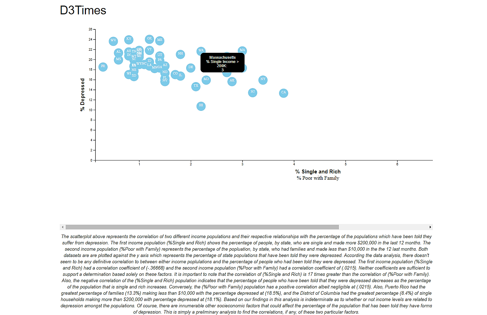

# Data Journalism and D3

<a target='_blank' href="https://giphy.com/gifs/newspaper-press-v2xIous7mnEYg">  <em>via GIPHY</em></a>

Sourced data from the US Census Bureau and Behavioral Risk Factor Surveillance System to investigate the health risks facing particular demographics. Examined the correlation between depression and different socioeconomic groups and visualized the correlation with a scatter plot embedded into an HTML file.

Languages and Tools:
- Excel
- HTML
- JavaScript
- D3

