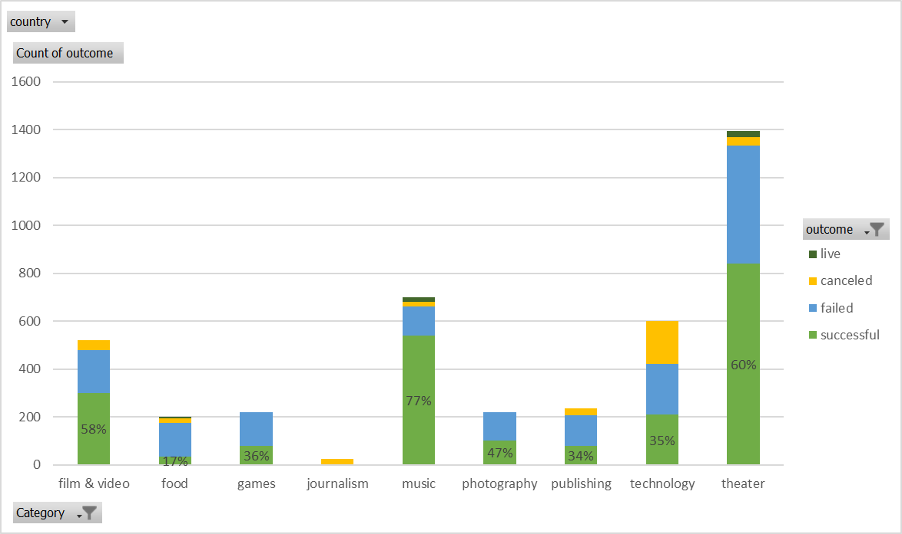
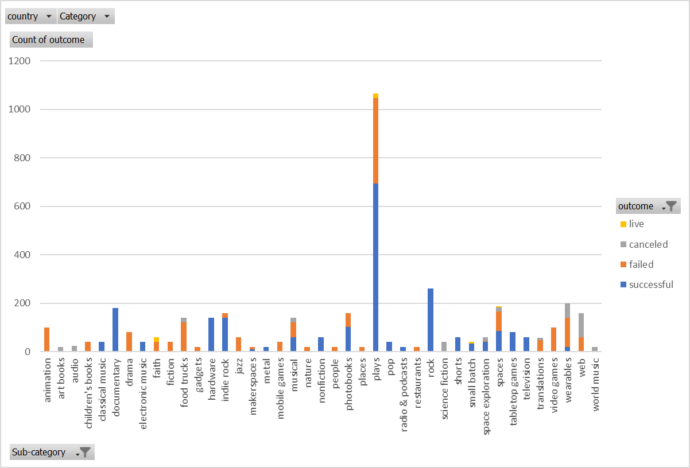
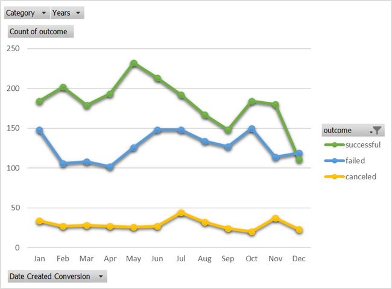
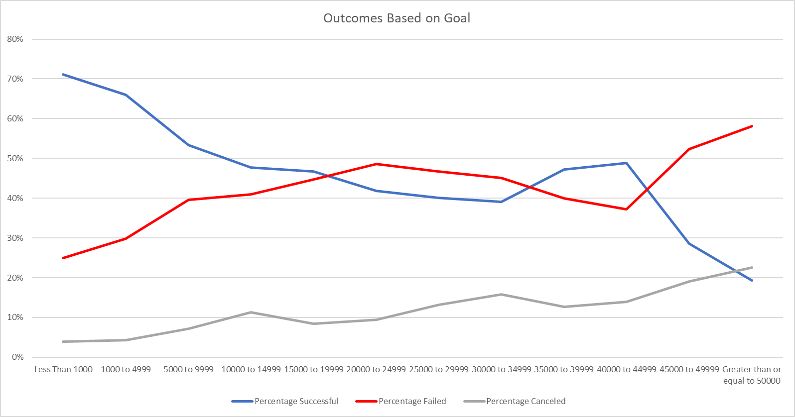

**Introduction**

Over two billion dollars have been raised using the massively successful crowdfunding service, Kickstarter, but not every project has found success. Of the over 300,000 projects launched on Kickstarter, only a third have made it through the funding process with a positive outcome.

Since getting funded on Kickstarter requires meeting or exceeding the project&#39;s initial goal, many organizations spend months looking through past projects in an attempt to discover some trick to finding success. For this week&#39;s homework, you will organize and analyze a database of four thousand past projects in order to uncover any hidden trends.

**Preliminary Analysis**

We started with a dataset of 4,000 projects, and created additional features to include, &quot;Percent Funded&quot; and &quot;Average Donation&quot;. The &quot;Category and Sub-Category&quot; feature was also divided into two, separate columns labeled, &quot;Category&quot; and &quot;Sub-Category&quot;, to more accurately define the results in later analyses. Next, we conducted exploratory data analysis to quickly identify any trends by color coding the outcome and percentage funded categories.

**Data Analysis**

First, we examined the relationship between the project category and its outcome to determine which category had the highest success rate. As shown in Figure 1, the category that had the highest success rate was Music (77%), followed by Theater (60%), and Film &amp; Video (58%) respectively.

Figure 1 Stacked Column Chart representing the different outcomes by category

Next, we performed a similar examination on the relationship between the project sub-category and the outcome to analyze which subcategories were most likely to succeed. Figure 2 shows that the subcategories which are most likely to succeed are Rock (Music), Documentary (Film &amp; Video), and Hardware (Technology). These three subcategories all had 100% success rates, but Rock had the highest number of projects (260), then Documentary (180), then Hardware (140).

Figure 2 Stacked Column Chart representing outcomes by subcategory

The next relationship we analyzed was based on the time of year (month) in which the project was conducted and the subsequent outcomes. Figure 3 is a line graph representation of the data, and it shows that projects conducted in the first half of the year are significantly more likely to succeed than those conducted in the latter half. Note, the month of May had the highest number of successful outcomes where December had the least.

Finally, we examined the different outcomes based on the project&#39;s goals. The line chart in Figure 4 seems to indicate that, the lower goal, the more likely it is to succeed. It is important to note that, of the goals that are 19,999 or higher, there seems to be an optimal goal range at 40,000-44,999.

Figure 4 Line Chart representing outcomes based on goals

**Conclusions**

Based on the results of the data we analyzed, we can make some fairly confident assertions about likelihood of a successful outcome based on the project&#39;s category, sub-category, and timing. Put plainly, it appears that the category with the highest likelihood of success is Music. The sub-category with the most successful projects was Rock. It is important to note, that the Rock sub-category had more successful projects than any other sub-category regardless of its parent category. It is also significant to note that every project within the Rock subcategory achieved success. The results also show, quite definitively, that May is the best month in which to conduct a campaign. Finally, the results of our final analysis show that projects with smaller goals (less than 5000) are the most successful and project with goals greater than 45,000 are the least likely to succeed. For goals that are greater than 10,000, there is an optimal success rate a goal range of 40,000 to 44,999.

**Limitations**

- The dataset used only represented about 1% of the total number of Kickstarter campaigns conducted, and may not accurately represent the data of all Kickstarter campaigns.
- Scope limitations – The scope of our assignment was only to evaluate three conclusions based on the data. There may be other factors that influence the success of a campaign that were not analyzed. For example, the duration of the campaign, geographical considerations, whether or not the campaign was &quot;staff picked&quot;, details concerning the blurb (i.e. optimal number of words, or characters), and average donation are all additional analyses that could be conducted to make additional conclusions.
- Lack of information about the Backers restricted our ability to conduct further analysis as to which types of Backers are most associated with successful campaigns.
- There may be additional categories or sub-categories that our dataset didn&#39;t include, thus, aren&#39;t represented in our analysis.

**Future Work**

As we mentioned earlier, there are several other factors of interest that could be analyzed. More specifically, a report including the likelihood of conducting a successful campaign based on:

- The duration of the project
- Geography – by country, by state (USA)
- Whether or not the campaign was designated as a &quot;staff pick&quot;
- Backer information – number of backers, demographic data, social network, etc.
- Average Donation
- Blurb information – number of words, number of characters

would yield a more comprehensive analysis with increased confidence in the accuracy of its findings.

