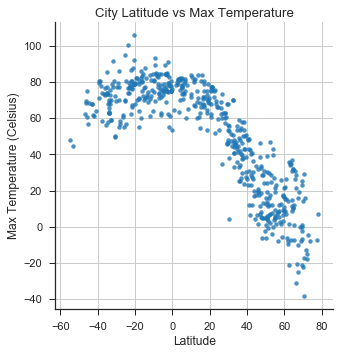
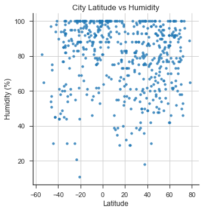
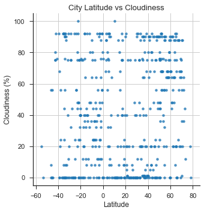
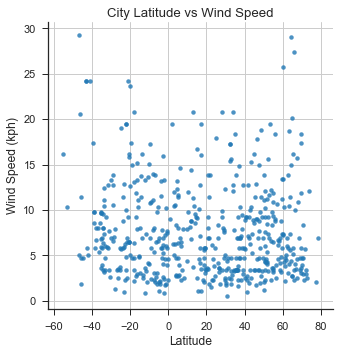

## WeatherPy

In this example, I created a Python script to visualize the weather of 500+ random (non-repeat) cities across the world of varying distance from the equator by utilizing a [simple Python library](https://pypi.python.org/pypi/citipy), the [OpenWeatherMap API](https://openweathermap.org/api), and a little common sense to create a representative model of weather across world cities and performing a weather check on each of the cities using a series of successive API calls.

The objective is to build a series of scatter plots to showcase the following relationships:

* Temperature (F) vs. Latitude

* Humidity (%) vs. Latitude

* Cloudiness (%) vs. Latitude

* Wind Speed (mph) vs. Latitude

Languages and Tools: 
- Python
- Pandas
- Numpy
- Requests
- Citipy
- API Calls
- Matplotlib
- Seaborn

