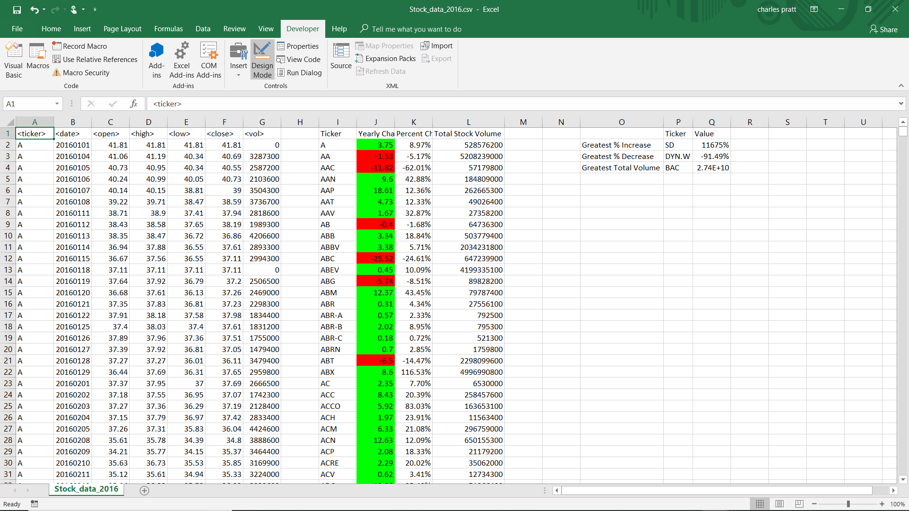

### Stock Market Analyst

Created a script that loops through all the stocks and takes the following info:
  - Yearly change from what the stock opened the year at to what the closing price was.
  - The percent change from the what it opened the year at to what it closed.
  - The total Volume of the stock
  - Ticker symbol

Created conditional formatting that highlights positive change in green and negative change in red.
Result:

