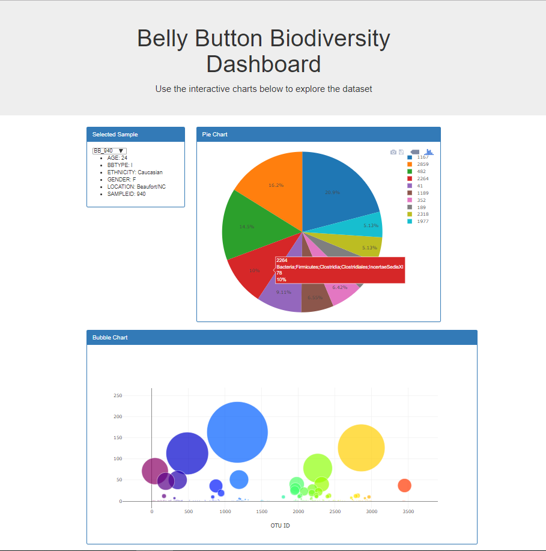

### Belly Button Biodiversity

Used Flask to design an API for the Belly Button Biodiversity Dataset and to serve the HTML and Javascript required for a dashboard page. Used Plotly to build interactive charts for the dashboard.

Languages and Tools:
- Flask
- API Calls
- HTML
- JavaScript
- SQLite
- SQLAlchemy
- Bootstrap
- Plotly

