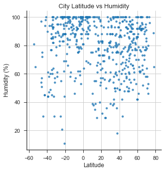
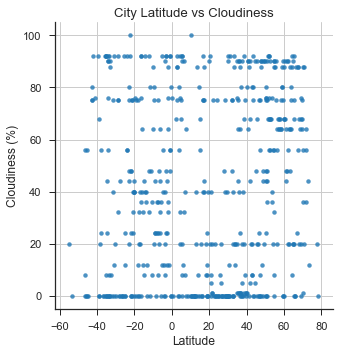

## WeatherPy

In this example, I created a Python script to visualize the weather of 500+ random (non-repeat) cities across the world of varying distance from the equator by utilizing a [simple Python library](https://pypi.python.org/pypi/citipy), the [OpenWeatherMap API](https://openweathermap.org/api), and a little common sense to create a representative model of weather across world cities and performing a weather check on each of the cities using a series of successive API calls.

The objective is to build a series of scatter plots to showcase the following relationships:

* Temperature (F) vs. Latitude

* Humidity (%) vs. Latitude

* Cloudiness (%) vs. Latitude

* Wind Speed (mph) vs. Latitude

### Observable Trends
- Trend 1 - Temperature vs Latitude Plot shows that the temperatures are higher the closer they are to the equator (latitude     range of -20 to 20)
- Trend 2 - City Latitude vs Windspeed Plot shows that Windspeeds are somewhat indifferent to Latitudes, but it is important to note that highest wind speed outliers all occur at latitudes furthest from the equator.
- Trend 3 - Based on the data, it seems as though cloudiness and humidity are relatively consistent across all latitudes. Further analysis to include an additional variable may reveal further insights into those relationships

Languages and Tools: 
- Python
- Pandas
- Numpy
- Requests
- Citipy
- API Calls
- Matplotlib
- Seaborn

